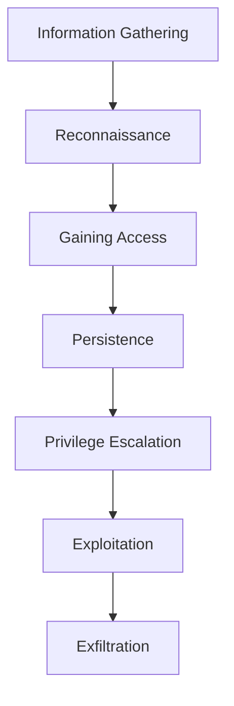

In the world of **information security**, just like a business, we want to avoid risks. So what are these risks? To understand what a risk is, we first need to understand the concept of vulnerability.

## What Are Risks?

To grasp the concept of a risk, we must first understand **vulnerabilities**:

- **Vulnerability**: A weakness or a gap in the system, and if exploited by a malicious actor, could help them gain unauthorized access and compromise the system.
- **Risk**: The potential for a threat to exploit a vulnerability, resulting in some form of loss.

> **Key Insight**: Risks arise when threats have the opportunity to exploit vulnerabilities, potentially causing significant damage to systems or data.

## Mitigating Threats and Vulnerabilities

In information security, the goal is to **mitigate or reduce the effectiveness** of threats against vulnerabilities. This is achieved through **countermeasures** that:

- Do not eliminate the threat entirely.
- Reduce the likelihood of a threat successfully exploiting a vulnerability.

### Identifying Vulnerabilities

One of the primary tasks is building a robust security fortress begins with identifying vulnerabilities within information systems. Common vulnerabilities include:

- **Misconfigurations**: Allowing access without controls (e.g., incorrect login settings enabling unauthorized access).
- **Insecure Connections**: Weak links between system elements.
- **Substandard Backup and Recovery**: Inadequate data protection measures.
- **Inadequate Endpoint Security**: Weak defenses on devices accessing the system.

> **Warning**: Any of these vulnerabilities can be leveraged by attackers to gain unauthorized access.

## Vulnerability Scanning: A Proactive Approach

To address vulnerabilities, organizations and individuals (e.g., website operators) can perform **periodic vulnerability scanning**. This process involves:

- **Detecting Loopholes**: Identifying flaws, cracks, or weaknesses in the system.
- **Passive Scanning**: Gathering information without injecting malicious software.

### Popular Vulnerability Scanners

| Scanner    | Interface                      | Key Features                                                               |
|------------|--------------------------------|----------------------------------------------------------------------------|
| **Nikto**  | Command-Line Interface (CLI)   | Lightweight, ideal for Linux users, focuses on web server vulnerabilities. |
| **Nessus** | Graphical User Interface (GUI) | Comprehensive, supports credentialed and non-credentialed scans.           |

#### Types of Nessus Scans

- **Credentialed Scan**:
  - Allows login to devices for more accurate findings.
  - Provides detailed insights beyond open ports.
- **Non-Credentialed Scan**:
  - Performed without login credentials.
  - Limited to identifying open ports and surface-level issues.

> **Important Note**: Vulnerability scans are **passive** and focus on reconnaissance. However, **authorization** is required before scanning any network, especially corporate systems, to avoid policy violations or triggering alerts.

## Penetration Testing: Active Security Validation

Unlike vulnerability scanning, **penetration testing** is an **active** process designed to:

- Simulate real-world attacks.
- Test whether security controls can be bypassed.
- Identify exploitable vulnerabilities before malicious actors do.

### Penetration Testing Process

The standard process for a penetration test includes the following stages:

1. **Information Gathering**: Collecting data about the target system.
2. **Reconnaissance**: Analyzing the system for potential entry points.
3. **Gaining Access (Initial Compromise)**: Attempting to breach the system.
4. **Persistence**: Maintaining access to the system.
5. **Privilege Escalation**: Gaining higher-level access.
6. **Exploitation**: Exploiting vulnerabilities to achieve objectives.
7. **Exfiltration**: Extracting sensitive data.

### Penetration Testing Tools

A widely used tool for penetration testing is **Metasploit**:

- **Developed by**: Rapid7
- **Interface**: Command-Line Interface (CLI)
- **Capabilities**:
    - Exploits a wide range of systems and machines.
    - Validates defenses after system patches.
- **Output**: Generates detailed reports on tools, tactics, and techniques used.

> **Pro Tip**: Documenting findings in a penetration test report is critical for improving system security and justifying investments.

## Why Penetration Testing Matters

Penetration testing provides organizations with:

- **Insight into Weaknesses**: Identifies insecure components and methods of exploitation.
- **Investment Guidance**: Highlights areas for improving infrastructure security.
- **Risk Mitigation**: Verifies the effectiveness of security controls to prevent unauthorized access.

By combining vulnerability scanning and penetration testing, organizations can proactively strengthen their defenses and reduce the likelihood of successful attacks.