**Blue-Green Deployment** and **Canary Deployment** are advanced techniques for deploying software updates, designed to *minimize risk*, *reduce downtime*, and ensure a smooth user experience. This article explores both methods, their workflows, and their practical applications.

## Overview of Deployment Strategies

- **Blue-Green Deployment**: Runs *two identical production environments* (Blue and Green), routing traffic to one at a time, enabling seamless transitions between versions with minimal downtime.
- **Canary Deployment**: Uses a *phased approach*, rolling out updates to a *subset of users* for testing before a full release, prioritizing risk awareness.

> **Key Insight**: Blue-Green deployment focuses on *instantaneous switching*, while Canary deployment emphasizes *incremental testing*.

## Blue-Green Deployment

**Blue-Green Deployment** eliminates *application downtime* and mitigates risks that could impact a *business* or *development team*. At any time, only *one environment* (Blue or Green) is live, serving all *production traffic*.

### How It Works
1. **Setup**: Maintain two mirrored production environments (*Blue* and *Green*). For example, Blue is live, and Green is idle.
2. **Deployment**: Deploy and test a new software version in the *idle environment* (e.g., Green).
3. **Testing**: Thoroughly test the new version in Green to ensure stability.
4. **Switch**: Once validated, redirect all *incoming traffic* to Green using a *router* or *DNS*. Green becomes live, and Blue becomes idle.
5. **Rollback**: If issues arise, switch traffic back to Blue, as it remains intact.

### Benefits
- **Zero Downtime**: Seamless transition between environments.
- **Low Risk**: Idle environment allows thorough testing before going live.
- **Quick Rollback**: Revert to the previous environment if needed.

> **Pro Tip**: Blue-Green deployment is ideal when confidence in the release is high due to robust testing practices.

### Implementation
- Mirror *Blue* and *Green* environments with identical infrastructure.
- Use *networking* (e.g., *DNS*) to control user routing.
- Push changes to all nodes in the target environment (Blue or Green) simultaneously.

## Canary Deployment

**Canary Deployment** focuses on *testing* new software on a *small subset of users* before a full *production rollout*, reducing the risk of *application failure* and catching *bugs* early.

### How It Works
1. **Initial Rollout**: Deploy the new code to a *small group* of unaware users.
2. **Testing**: Monitor the subset for *bugs* or *broken features*.
3. **Phased Expansion**: Gradually roll out the code to all users after successful testing.
4. **Rollback**: Revert if significant issues are detected during the canary phase.

### Benefits
- **Risk Mitigation**: Limits the impact of bugs to a small user group.
- **Early Detection**: Identifies issues before a full release.
- **Controlled Impact**: Minimizes points of failure in production.

### Challenges
- **Increased Complexity**: Managing multiple software versions in a *live production environment*.
- **Higher Costs**: Testing subsets adds overhead.
- **Considerations**:
    - *Code Refactoring*: How much does the new version differ from the old?
    - *Performance and Scalability*: Does the new version perform better?
    - *Edge Cases*: Are functional issues addressed?

> **Key Consideration**: Canary deployment is best for significant changes (e.g., integrating a *payment gateway*), not minor updates (e.g., changing a *background color*).

### Implementation Methods
- **Load Balancer**: Route traffic based on *request headers*.
- **Codebase Partitioning**: Segment the user base within the application code.
- **Traffic Management**: Control which users receive the new version.

## Practical Example: Canary Deployment on Kubernetes

To set up a **Canary Deployment** on *Kubernetes*:

1. **Pull a Docker Image**: Obtain the necessary application image.
2. **Create a Kubernetes Deployment**: Define the initial deployment configuration.
3. **Create a Service**: Set up a service to manage traffic to the deployment.
4. **Check Version**: Verify the current deployment version.
5. **Create a Canary Deployment**: Deploy the new version to a subset of pods.
6. **Run Canary Deployment**: Route a small portion of traffic to the canary pods.
7. **Monitor**: Observe the canary version for issues before full rollout.

## Blue-Green vs. Canary: When to Use

| Deployment Type | Approach | Best For | Considerations |
|-----------------|----------|----------|----------------|
| **Blue-Green** | Deploys to all users at once | High-confidence releases with robust testing | Requires mirrored environments |
| **Canary** | Deploys incrementally to subsets | Risk-aware releases needing real-user testing | Increases complexity and cost |

### Decision Factors
- **Blue-Green**: Suitable when *testing infrastructure* ensures release reliability, allowing instant deployment to all users.
- **Canary**: Preferred when *testing is incomplete*, requiring partial releases to validate stability with real users.

> **Pro Tip**: Choose Canary deployment for complex updates needing validation, and Blue-Green for streamlined, well-tested releases.

## Deployment Workflow Diagram

The following diagram illustrates the workflows for Blue-Green and Canary deployments:

```mermaid
graph TD
    subgraph Blue-Green Deployment
        A[Blue Environment<br>Live] -->|Deploy New Version| B[Green Environment<br>Idle]
        B -->|Test & Validate| C[Switch Traffic<br>Green Live]
        C -->|Idle| D[Blue Environment]
    end
    subgraph Canary Deployment
        E[Current Version<br>Live] -->|Deploy to Subset| F[Canary Version<br>Small User Group]
        F -->|Monitor & Test| G[Roll Out to All Users]
        G -->|Stable| H[New Version Live]
    end

    classDef live fill:#bbdefb,stroke:#1976d2;
    classDef idle fill:#ffccbc,stroke:#d84315;
    classDef canary fill:#d4f4d4,stroke:#2e7d32;
    class A,E,G,H live;
    class B,D idle;
    class F canary;
```

## Conclusion

In brief, the essence of **Blue-Green Deployment** is *deploying at once*, ensuring *zero downtime* and *low risk* through mirrored environments. The essence of **Canary Deployment** is *deploying incrementally*, prioritizing *risk awareness* by testing with a subset of users. **Blue-Green** is more suitable for situations where you have practices that allow you to be confident about your release, while **Canary** is better when your *testing infrastructure* cannot complete testing, requiring a *partial release*. By understanding these strategies, teams can choose the best approach to deliver reliable, safe software updates.