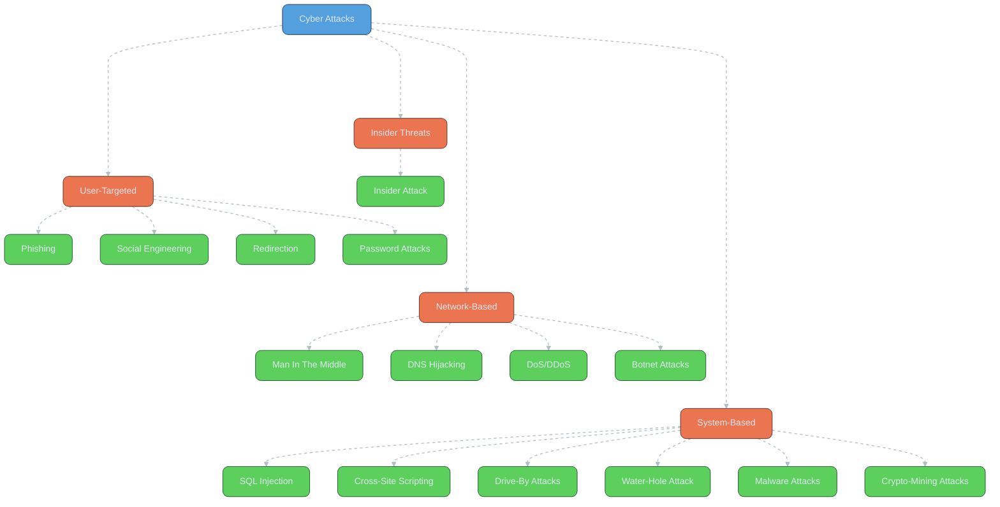

**Cyber Attacks** are occurring every minute. As *technology* rapidly progresses, so does the thinking to *exploit* this technology to steal *information* and *sensitive data*. Cyber attacks are designed to fulfill an *objective* by affecting a *vulnerable target*, concealing its *identity*, and eventually *damaging* or *disrupting* operations.

Here are the *cyber attacks* you need to be aware of:

## Types of Cyber Attacks

### 1. Man In The Middle (MiTM)
This type of cyber attack happens when a *hacker* introduces him/herself between your *network* and a *server*, interjecting and *stealing information*.

- **Complexity**: Better *security technologies* have made MiTM attacks more complex; the only groups attempting these attacks are *sophisticated hackers* and *state actors*.
- **Impact**: Intercepts sensitive communications, compromising data integrity.

> **Key Risk**: MiTM attacks can silently steal data during network transactions.

### 2. Phishing
A *phishing attack* is where an attacker sends you *fraudulent emails* with *clickable links*. It compels the user to open the *malicious attachment* or click links that lead the user to *web pages* (bogus sites) identical to the *legitimate website*.

- **Advice**: Do not click any links from *unknown* or *untrusted emails*.
- **Impact**: Steals credentials or installs malware via deceptive sites.

> **Pro Tip**: Verify email senders and avoid clicking unsolicited links to prevent phishing.

### 3. SQL Injection
An *SQL Injection* attack is when an attacker injects *malicious SQL queries* into the *database* to manipulate it and *exfiltrate sensitive data*.

- **Mechanism**: SQL statements control your *web application database* and can be used to *bypass security measures* if *user inputs* are not properly *sanitized*.
- **Capabilities**: A successful SQL injection can:
    - Read *sensitive data* from the database.
    - Modify *database data*.
    - Execute *administration operations* on the database.
    - Recover the content of a *given file* present on the DBMS file system.
    - Issue *commands* to the operating system.
- **Impact**: Compromises database integrity and exposes sensitive information.

> **Key Consideration**: Sanitize user inputs to prevent SQL injection vulnerabilities.

### 4. Cross-Site Scripting (XSS)
This type of attack uses a *third-party website* to inject *malicious JavaScript code* into the target’s *web browser* to *steal data*.

- **Execution**: The code runs within a user’s *browser*. Upon initial injection, the site typically isn’t fully controlled by the attacker. Instead, the *bad actor* attaches their *malicious code* on top of a *legitimate website*, tricking browsers into executing their *malware* whenever the site is loaded.
- **Types**:
    - **Stored XSS**: Injected script is *stored* on the server (e.g., in a *forum post* or *comment*). Every user visiting the infected page is affected.
    - **Reflected XSS**: Injected script is served as a *response* to a request (e.g., *search results page*).
- **Impact**: Steals user data or session tokens via browser execution.

> **Key Risk**: XSS exploits trusted websites to deliver malware to unsuspecting users.

### 5. Social Engineering
*Social engineering* uses *psychological manipulation* to trick users into making *security mistakes* and give away *sensitive information*.

- **Common Form**: *Phishing* is one of the most common types of attack used in this case.
- **Process**:
    - The *delinquent* investigates the intended *victim* to gather *background information*, such as *potential points of entry* and *weak security protocols*.
    - The attacker gains the *victim’s trust* and provides *stimuli* for actions that break *security practices*, such as revealing *sensitive information* or granting access to *critical resources*.
- **Impact**: Exploits human trust to bypass technical defenses.

> **Pro Tip**: Educate users to recognize social engineering tactics, like suspicious requests.

### 6. DNS Hijacking
The *DNS* is the protocol used to map *domain names* to *IP addresses*. The attack works when *hackers* exploit the way *DNS* communicates with an *internet browser*.

- **Mechanism**: The system acts as a *phone book*, translating a domain, e.g., “byte.net,” into an *IP address*. The *DNS* then looks up and finds which *global server* is hosting that site and directs *traffic*. The attack happens when a hacker can *disrupt* the DNS lookup and either push the site *offline* or *redirect traffic* to a site that the *hacker controls*.
- **Impact**: Redirects users to malicious sites or disrupts access.

> **Key Risk**: DNS hijacking can compromise entire websites or networks.

### 7. Drive-By Attacks
These attacks are used to *spread malware* by targeting *insecure websites* with *unintentional file/software downloads*.

- **Execution**: Simply *accessing* or *browsing* a website can activate the *download*. The *malicious code* is designed to download *malicious files* onto the victim’s device without the user’s *knowledge*.
- **Impact**: Installs malware covertly, compromising device security.

> **Key Consideration**: Keep browsers and systems updated to mitigate drive-by attacks.

### 8. Water-Hole Attack
These attacks *compromise* a specific group of *end-users* by infecting a user’s *computer* with *malicious code* to get access to the *network*.

- **Process**:
    - Attackers *profile* their target to determine the *websites* they frequently visit.
    - They identify *vulnerabilities* in these websites to *exploit*.
    - The *compromised website* infects the user’s *network*, allowing attackers to gain *entry* and move *laterally* to other systems.
- **Impact**: Targets specific groups for network infiltration.

> **Key Risk**: Water-hole attacks exploit trusted websites to target specific users.

### 9. Denial of Service (DoS) & Distributed DoS (DDoS)
This attack is one of the most *widespread attacks*, which is done by making a *resource* unavailable to the user by *disrupting* the user’s *services* connected to the *internet*.

- **Distributed DoS**: Multiple *machines* operate to attack one *target user*.
- **Methods**: Executed by *flooding networks* with *traffic* or sending *information* that triggers a *system slowdown* or *complete crash*.
- **Targets**: Often focus on *high-profile organizations* or ones with *public-facing websites* such as *banking*, *commerce*, *media*, or *government institutions*.
- **Origin**: DoS attacks can originate from *anywhere in the world*. *Malicious actors* can easily *mask* their whereabouts to *overwhelm* victim computers.
- **Impact**: Disrupts service availability, causing operational downtime.

> **Key Risk**: DoS/DDoS attacks can cripple critical infrastructure.

### 10. Redirection
The *malicious actor* might make a *phishing attempt*, sending an *email* that includes a *copycat* of the website’s *URL*, e.g., “linkedin.com,” to the unsuspecting *victim*.

- **Execution**: If the website appears *legitimate*, users might inadvertently *share personal information* by filling out any *prompts* or *forms* that appear.
- **Impact**: Steals sensitive data through deceptive interfaces.

> **Pro Tip**: Verify URLs carefully to avoid redirection scams.

### 11. Password Attacks
Attackers leverage *password authentication mechanisms* to gain access to a user’s *data*.

- **Types**: Can be *online* or *offline* attacks.
- **Impact**: Compromises user accounts and sensitive information.

> **Key Consideration**: Use strong, unique passwords and enable MFA to thwart password attacks.

### 12. Malware Attacks
These are attacks where any *unwanted software* is injected into your *system* with your *approval*.

- **Example**: A *Trojan*.
- **Impact**: Disrupts system functionality or steals data.

> **Key Risk**: Malware often requires user interaction to activate, making awareness critical.

### 13. Insider Attack
These attacks are caused through the activities of a *disgruntled employee* or *ex-employee*.

- **Severity**: Can be *very dangerous* and *cost heavily*.
- **Impact**: Exploits internal access to cause significant damage.

> **Key Risk**: Insider threats leverage trusted access, bypassing external defenses.

### 14. Crypto-Mining Attacks
In this kind of attack, *crypto criminals* hack into *computer systems*, *laptops*, *mobile devices*, or *tablets* to install *software* that uses the computer’s *power* to rob or steal the owner’s *cryptocurrency*.

- **Impact**: Drains system resources and steals digital assets.

> **Key Consideration**: Monitor system performance to detect crypto-mining activity.

### 15. Botnet Attacks
*Botnets* are a *collection* of *system networks* in which *attackers* have been *infected* with *malware*, allowing these attackers to *control* them *remotely*.

- **Execution**: Enables *coordinated attacks* at a *mass scale*.
- **Impact**: Amplifies the scale and impact of other attacks (e.g., DDoS).

> **Key Risk**: Botnets can overwhelm systems with coordinated malicious activity.

## Cyber Attack Overview

| Attack Type | Method | Impact |
|-------------|--------|--------|
| **Man In The Middle (MiTM)** | Intercepts network-server communication | Data theft |
| **Phishing** | Fraudulent emails with malicious links | Credential theft, malware |
| **SQL Injection** | Malicious SQL queries | Database compromise |
| **Cross-Site Scripting (XSS)** | Injected JavaScript in browsers | Data theft via trusted sites |
| **Social Engineering** | Psychological manipulation | Sensitive data exposure |
| **DNS Hijacking** | Disrupts DNS lookup | Traffic redirection |
| **Drive-By Attacks** | Malware via insecure websites | Covert malware installation |
| **Water-Hole Attack** | Compromised websites target groups | Network infiltration |
| **DoS/DDoS** | Overwhelms services | Service disruption |
| **Redirection** | Fake URLs in phishing | Data theft via forms |
| **Password Attacks** | Exploits password mechanisms | Account compromise |
| **Malware Attacks** | Unwanted software (e.g., Trojan) | System disruption |
| **Insider Attack** | Disgruntled employee actions | Internal damage |
| **Crypto-Mining Attacks** | Steals computing power | Resource drain, crypto theft |
| **Botnet Attacks** | Remote-controlled infected systems | Mass-scale attacks |

## Cyber Attack Workflow Diagram

The following diagram categorizes the cyber attacks by their primary method:

## Conclusion

**Cyber attacks** do not just affect one person; they affect *us all*. They cause *massive damages* to businesses concerning *capital* as well as *jobs*. They can take on *many forms* and *attack* in different ways. If one person is *targeted*, the chances are most likely *you will be too*. A user should remain in a *continuous education loop* to maintain a *strong security stance* against cyber attacks.

## References
- [Sucuri Blog](https://blog.sucuri.net)
- [OWASP](https://owasp.org/)