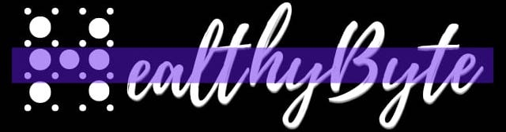

# Home

    

HealthyByte is your go-to blog for enhancing digital security awareness. Through insightful articles, practical tools, and valuable resources, HealthyByte aims to empower readers to protect their digital lives. Whether you're just starting your cybersecurity journey or you're a seasoned expert, this blog offers something for everyone to stay informed, secure, and ahead in the ever-changing world of cybersecurity.

## Contributing

Please checkout the [GitHub page](https://github.com/Shasheen8/h.byte) for more!

## Disclaimer

The information and tools provided by HealthyByte are intended for educational and informational purposes only. While every effort is made to ensure accuracy and reliability, HealthyByte does not guarantee the completeness or applicability of the content for all situations. Users are responsible for applying this information responsibly and in compliance with applicable laws and regulations. HealthyByte is not liable for any damages or losses resulting from the use or misuse of the provided resources.
